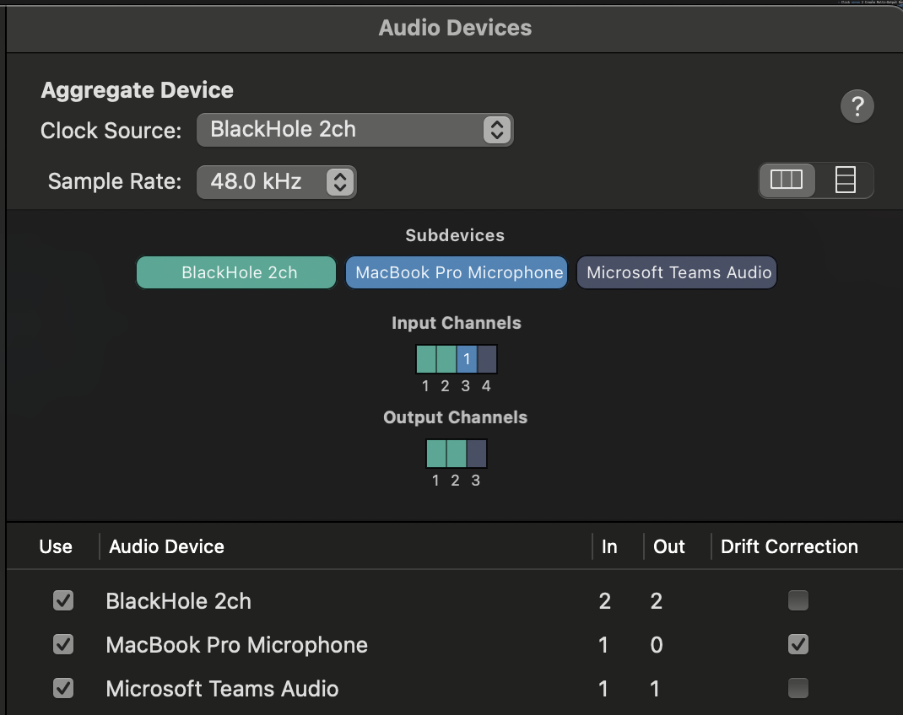
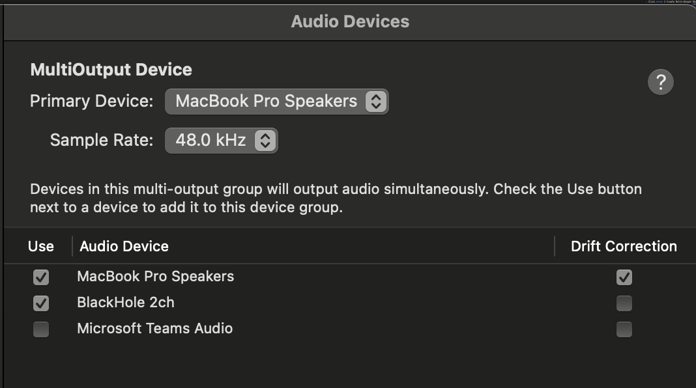

# NoteNinja 🥷

Local AI meeting note-taker for macOS and Windows. Records in-person meetings or Teams/phone calls, transcribes with OpenAI Whisper, and generates structured notes with Claude. A ninja icon lives in your menu bar (Mac) or system tray (Windows), watches for calls, and sends a desktop notification when one starts.

No account needed beyond OpenAI and Anthropic. Everything runs locally — your audio never leaves your machine.

---

## Table of Contents

**Getting started**
- [Quick Start](#tldr--quick-start)
- [What you need](#what-you-need)

**Desktop app**
- [Running on macOS](#macos)
- [Running on Windows](#windows)
- [Menu bar & system tray](#menu-bar--system-tray)
- [CLI commands](#cli-usage)
- [Start on login](#run-on-startup)

**Features**
- [Adding extra context to notes](#extra-context)
- [API keys & settings](#api-keys--settings)
- [Crash recovery](#how-it-works)

**For developers**
- [JavaScript SDK](#javascript-sdk)
- [How it works](#how-it-works)
- [Run tests](#run-tests)
- [Privacy](#privacy)

---

## TL;DR — Quick Start

**1. Get API keys:**
- [OpenAI](https://platform.openai.com/api-keys) — transcribes your audio (~$0.006/min)
- [Anthropic](https://console.anthropic.com/settings/keys) — writes the meeting notes (~$0.01/meeting)

**2. Run it:**
```bash
./nj        # macOS — first run installs everything automatically
nj.bat      # Windows
```

That's it. First run detects missing dependencies and sets everything up.

**3. For Teams/phone calls** — install the audio router first:
- macOS → `brew install blackhole-2ch` then follow the [Audio MIDI Setup](#2-configure-audio-midi-setup-one-time) steps below
- Windows → install [VB-Audio Virtual Cable](https://vb-audio.com/Cable) then follow the [audio routing](#2-configure-audio-routing-one-time) steps below

The 🥷 menu bar icon (Mac) or NJ tray icon (Windows) watches for calls in the background. To have it start automatically on login, click the icon → **Start at Login**.

---

## What you need

### Required

| Account | Cost | Purpose |
|---|---|---|
| [OpenAI](https://platform.openai.com) | ~$0.006/min | Converts speech → text (Whisper). Hears the words, doesn't understand them. |
| [Anthropic](https://console.anthropic.com) | ~$0.01/meeting | Reads the transcript → writes structured notes (Claude). Understands context, finds action items. |

### Optional — speaker diarization (who said what)

| Account | Cost | Purpose |
|---|---|---|
| [HuggingFace](https://huggingface.co) | Free | Downloads the pyannote speaker diarization model (~1 GB, one-time) |

HuggingFace setup (5 min, free):
1. Create an account at huggingface.co
2. Accept terms at [pyannote/speaker-diarization-3.1](https://huggingface.co/pyannote/speaker-diarization-3.1)
3. Accept terms at [pyannote/speaker-diarization-community-1](https://huggingface.co/pyannote/speaker-diarization-community-1)
4. Accept terms at [pyannote/segmentation-3.0](https://huggingface.co/pyannote/segmentation-3.0)
5. Create a token at [huggingface.co/settings/tokens](https://huggingface.co/settings/tokens) (read-only is fine)
6. Add it in **Settings** (click ⚙ in the menu bar icon) or paste into `.env`

The model runs entirely on your machine after download — no audio is ever uploaded.

---

## Installation

### macOS

#### 1. Install BlackHole (captures both sides of a Teams/phone call)

```bash
brew install blackhole-2ch
```

Reboot after it installs.

#### 2. Configure Audio MIDI Setup (one-time)

Open **Audio MIDI Setup** (Spotlight → "Audio MIDI Setup")

**Create an Aggregate Device** — captures your mic + the call audio together:
- Click **+** → Create Aggregate Device
- Check: **BlackHole 2ch**, **MacBook Pro Microphone**, **Microsoft Teams Audio**
- Set Clock Source to **BlackHole 2ch**
- Enable Drift Correction on **MacBook Pro Microphone**



**Create a Multi-Output Device** — so you can still hear the call while it records:
- Click **+** → Create Multi-Output Device
- Check: **MacBook Pro Speakers**, **BlackHole 2ch**
- Set Primary Device to **MacBook Pro Speakers**
- Enable Drift Correction on **MacBook Pro Speakers**



**Before each Teams call:**
- Teams → Settings → Devices → set **Speaker** to **Multi-Output Device**
- Switch back to your normal speakers when done

#### 3. Run setup

```bash
./setup.sh
```

This installs all dependencies, adds `nj` to your PATH, puts the 🥷 icon in your menu bar, and launches it immediately.

#### 4. From now on

```bash
nj
```

---

### Windows

#### 1. Install VB-Audio Virtual Cable (captures both sides of a Teams/phone call)

Download the free **VBCABLE** from [vb-audio.com/Cable](https://vb-audio.com/Cable). Reboot after it installs.

#### 2. Configure audio routing (one-time)

**Route Teams audio through the cable:**
- Teams → Settings → Devices → set **Speaker** to `CABLE Input (VB-Audio Virtual Cable)`

**So you can still hear the call:**
- Sound Settings → More sound settings → **Recording** tab
- Right-click **CABLE Output** → Properties → **Listen** tab
- Check **Listen to this device** → set Playback through your speakers/headphones

#### 3. Run setup

Open PowerShell in the NoteNinja folder:

```powershell
.\setup.ps1
```

This installs all dependencies, adds `nj.bat` to your PATH, puts the NJ icon in your system tray, and launches it immediately.

#### 4. From now on

```bat
nj.bat
```

---

## API keys & settings

Click ⚙ **Settings...** in the menu bar / tray icon to manage everything in one place:

- Enter or update your API keys (with show/hide toggle)
- Change the env var names if you already use the defaults for another project
- Point NoteNinja at any env file — `.env`, `~/.zprofile`, `~/.zshrc`, etc.
- Install BlackHole directly from Settings (macOS)
- **Get key →** links open the right page in your browser

Keys are saved to your chosen env file and never shared or uploaded.

---

## Menu bar / system tray

The 🥷 icon (Mac) or NJ icon (Windows) lives quietly in the menu bar and watches for calls. Click it to:

| Item | What it does |
|---|---|
| Watching for calls... | Current status |
| ⚡ Teams call detected | Appears when a call is active — click to start recording |
| ⏹ Stop Recording | Appears while a recording is active — click to stop and generate notes |
| Record in-person meeting | Opens a terminal and starts mic recording immediately |
| Record Teams call | Opens a terminal and starts Teams call recording |
| Recent meetings ▶ | Submenu of last 5 note files — click any to open |
| Open notes folder | Opens `~/meeting-notes/` in Finder / Explorer |
| ⏸ Pause watching | Stops auto-detection without quitting |
| Start at Login | ✓ when enabled — toggles whether the icon starts on login |
| ⚙ Settings... | Opens the settings window |
| Quit | Exit |

**Auto-detect:** When Teams is running and audio is flowing through the audio cable, NoteNinja sends a desktop notification and the ⚡ item appears in the menu.

---

## CLI usage

```bash
nj               # interactive menu
nj menubar       # launch menu bar / tray icon only
nj mic           # skip menu — record with mic immediately
nj teams         # skip menu — record Teams call immediately
nj logs          # tail the live log file (~/.noteninja.log)
nj-remove        # stop the menu bar and remove login item
```

**While recording:**
- `Esc` → stop and generate notes
- `p` + Enter → pause
- `r` + Enter → resume

**After every recording** you'll be prompted to add extra context (job description, agenda, resume, etc.) before notes are generated. Drag & drop a file into the terminal or paste text — blank line to skip.

Notes, transcripts, and audio are saved to `~/meeting-notes/`.

---

## Extra context

NoteNinja lets you give Claude additional context before generating notes — useful for interviews, sales calls, or any meeting where background information helps.

**After recording stops**, you'll see:
```
  Add extra context? (e.g. job description, agenda, resume)
  Drag & drop a file, paste text, or press Enter to skip:
```

Drag in a `.txt`, `.md`, `.pdf`, or `.docx` file, or just paste text directly. Press Enter on a blank line when done.

**Via the menu bar** — clicking ⏹ Stop Recording shows a dialog to enter context before stopping.

**When regenerating notes** (option 4 in the CLI), the same prompt appears so you can add context to any past recording.

---

## Run on startup

The menu bar / tray icon does **not** start on login by default. To enable it, click the 🥷 icon → **Start at Login**. A checkmark appears when it's on. Click again to turn it off.

No terminal is needed — the icon manages this itself.

---

## JavaScript SDK

NoteNinja exposes a local REST API and an npm-compatible SDK so you can embed recording into any web app — audio stays on the user's machine, users bring their own API keys.

```js
const NoteNinja = require('./sdk')

const nn = new NoteNinja({
  openaiKey:    process.env.OPENAI_API_KEY,
  anthropicKey: process.env.ANTHROPIC_API_KEY,
})

await nn.start()  // boots the local Python server on localhost:7627

const session = await nn.startRecording({ meetingName: 'Candidate Interview' })

// ... meeting happens ...

const { transcript, notes } = await session.stop({
  extraContext: 'Interviewing for junior developer role. See attached resume.',
})

await nn.stop()
```

**Other SDK methods:**
```js
await nn.devices()                          // list audio input devices
await nn.generateNotes(transcript, { extraContext: '...' }) // notes from existing transcript
```

**Run the API server standalone:**
```bash
python server.py            # starts on localhost:7627
python server.py --port 8000
```

The server auto-loads API keys from your `.env` file or environment variables. See `server.py` for the full API reference (`GET /health`, `GET /api/devices`, `POST /api/record/start`, `POST /api/record/stop`, `GET /api/record/status`, `POST /api/notes`).

---

## Run tests

```bash
nj pytest tests/ -v        # macOS
nj.bat pytest tests/ -v    # Windows
```

---

## How it works

```
Mic + BlackHole Aggregate Device (Mac)
Mic + VB-Audio CABLE Output (Windows)
        ↓
  Records all audio channels, mixes to mono
        ↓
  Live preview: Whisper transcribes every 30s and prints to terminal
  (chunks saved to ~/.noteninja_live_transcript.txt as a crash backup)
        ↓
  Final transcription:
    • With HuggingFace token → pyannote diarization + Whisper word timestamps
                                (labels Speaker A:, Speaker B:, etc.)
    • Without token         → Whisper only (plain transcript, no speaker labels)
        ↓
  Claude generates structured notes
  (attendees, key points, decisions, action items with times/owners)
        ↓
  Saved to ~/meeting-notes/MeetingName_timestamp_audio.wav
             ~/meeting-notes/MeetingName_timestamp_transcript.txt
             ~/meeting-notes/MeetingName_timestamp_notes.md
```

**Crash recovery:** If a recording is interrupted, the live transcript chunks are preserved in `~/.noteninja_live_transcript.txt`. The next time you open `nj`, it detects the file and offers to generate notes from it.

---

## Privacy

- Audio is sent to OpenAI Whisper for transcription (their [privacy policy](https://openai.com/policies/privacy-policy))
- Transcripts are sent to Anthropic Claude for note generation (their [privacy policy](https://www.anthropic.com/privacy))
- With HuggingFace diarization: audio is processed **entirely locally** — nothing uploaded
- API keys are stored in your local env file only
- Meeting notes, transcripts, and audio are saved only to your machine (`~/meeting-notes/`)
